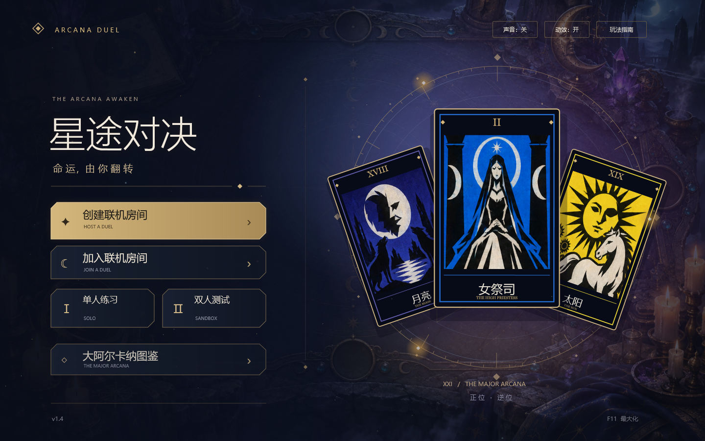

# 星途对决 · Arcana Duel

双人塔罗卡牌对战游戏。当前版本 **v1.4**，使用 **C# + WPF / .NET Framework 4.8**，在 Windows 上运行。支持局域网 / IP 直连、人机练习和一个人操作双方的测试模式。



## 换电脑继续开发

```powershell
git clone https://github.com/StevenYang723/ArcanaDuel.git
cd ArcanaDuel
powershell -NoProfile -ExecutionPolicy Bypass -File .\Build.ps1
.\build\ArcanaDuel.exe
```

环境：Windows 10/11，.NET Framework 4.8；构建脚本使用系统自带的 .NET Framework C# 编译器和 WPF 引用，不需要安装 Unity、Node.js、Visual Studio 或下载 NuGet 包。源码、美术资源和规则数据都在仓库中，构建后的 exe 内嵌美术与卡牌定义，可以单独运行。

**让新电脑上的 GPT / Codex 先阅读 `AGENTS.md` 和 `docs/PROJECT_STATE.md`，再继续改动。** 这些文件保存当前规则、交互约定、架构、测试入口、已知限制和手机版计划。GitHub 不会同步旧聊天，接手信息以仓库文档为准。

已有本地副本时先检查工作区，再更新：

```powershell
git status
git pull --ff-only
```

修改完成后，构建并做相应验证，再提交和推送：

```powershell
git add src docs README.md AGENTS.md Build.ps1 Test.ps1 cards.json tools
git commit -m "Describe the change"
git push
```

推送需要在新电脑登录有仓库写入权限的 GitHub 账号。可使用 GitHub Desktop、Git Credential Manager 或 GitHub CLI 的正常登录流程；不要把访问令牌写进代码或提交。

## 验证

```powershell
# 构建并执行规则检查
powershell -NoProfile -ExecutionPolicy Bypass -File .\Test.ps1 -RulesOnly

# 规则检查 + 实际 WPF 窗口检查（需要 Windows 桌面会话）
powershell -NoProfile -ExecutionPolicy Bypass -File .\Test.ps1
```

输出位于 `build/`，不进入版本控制。已有验证记录：1538 项规则检查、35 局完整模拟、v1.4 的 196 项界面检查；历史报告分别见 `docs/rules-v1.2.txt` 和 `docs/presentation-v1.4.txt`，不要把历史结果当作后续修改的验证结果。

## 已有功能

- 20 副大阿尔卡纳交替禁选，各选 3 副，自动加入愚者；每人 20 张牌。
- 21 格道路、双方各距终点 10 格；63 种卡牌、126 个正逆位效果。
- 点选费用 / 水晶后拖牌出场；双方播放出牌与效果动画。
- 悬停按 R 查看另一牌面；点击或右键手牌、点击弃牌区卡牌打开预览。
- 动态主页、浮动塔罗牌、星盘、星尘、烛光与局内符文，可关闭动效。
- 本机双人测试、人机练习、TCP 27841 局域网 / IP 直连，协议版本 3。

玩法见 [玩家指南](docs/PLAYER_GUIDE.md)，牌面设计见 [v0.2 卡牌设计](docs/CARD_DESIGN_v0.2.md)。

## 目录

```text
src/                  唯一正式源码；assets/ 中的两张 PNG 是必须提交的运行素材
docs/                 规则、平衡复核、接手文档、历史验证和主页截图
tools/                可选卡牌定义生成器（需要 Node.js，仅重新生成时使用）
Build.ps1             一键构建，输出 build/ArcanaDuel.exe
Test.ps1              一键验证
cards.json            v0.2 的可读规则目录；与内嵌 CardCatalog.cs 对应
AGENTS.md             给后续开发代理的工作说明
```

本项目当前仍是 Windows WPF 工程，**尚未迁移 Unity，也没有 iOS 安装包**。后续手机版方向是复用 C# 规则、美术与测试，重写 Unity 界面及触屏交互，再通过 Mac / 云端构建和 TestFlight 验证。此计划不是现成功能。

仓库尚未指定开源许可证；没有因为上传到 GitHub 而额外授予开源授权。
